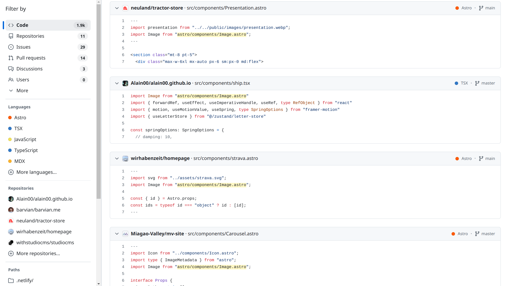

Yesterday, I migrated this site from Astro v4 to Astro v5 to make use of the experimental [SVG components](https://docs.astro.build/en/reference/experimental-flags/svg/).

I followed the [update guide](https://docs.astro.build/en/guides/upgrade-to/v5/).
It seemed like all I needed to do was change the collections code to work with the new Content Layer API.

All was going well with the Content Layer API in dev mode, so I ran `astro build`:

```console
$ pnpm build

...

17:27:10 [types] Generated 714ms
17:27:10 [check] Getting diagnostics for Astro files in /var/home/fisher/Repositories/fishersun.com...
Result (23 files): 
- 0 errors
- 0 warnings
- 0 hints

...

 generating static routes 
Cannot access '$$Image' before initialization
  Location:
    /var/home/fisher/Repositories/fishersun.com/node_modules/.pnpm/astro@5.2.5_@types+node@20.14.10_jiti@1.21.6_rollup@4.34.2_typescript@5.5.3_yaml@2.7.0/node_modules/astro/dist/core/build/pipeline.js:220:15
  Stack trace:
    at file:///var/home/fisher/Repositories/fishersun.com/dist/chunks/Image_BlEkfq-G.mjs:1907:10
    at async ModuleLoader.import (node:internal/modules/esm/loader:473:24)
    at async generatePages (file:///var/home/fisher/Repositories/fishersun.com/node_modules/.pnpm/astro@5.2.5_@types+node@20.14.10_jiti@1.21.6_rollup@4.34.2_typescript@5.5.3_yaml@2.7.0/node_modules/astro/dist/core/build/generate.js:81:21)
    at async AstroBuilder.build (file:///var/home/fisher/Repositories/fishersun.com/node_modules/.pnpm/astro@5.2.5_@types+node@20.14.10_jiti@1.21.6_rollup@4.34.2_typescript@5.5.3_yaml@2.7.0/node_modules/astro/dist/core/build/index.js:154:5)
    at async build (file:///var/home/fisher/Repositories/fishersun.com/node_modules/.pnpm/astro@5.2.5_@types+node@20.14.10_jiti@1.21.6_rollup@4.34.2_typescript@5.5.3_yaml@2.7.0/node_modules/astro/dist/core/build/index.js:45:3)
 ELIFECYCLE  Command failed with exit code 1.
```

Strange, no type errors, but it's breaking? Ctrl-Fing through the upgrade guide for "Image" found nothing related.
And neither searching Google nor searching Astro's issues for this error message yielded any helpful information.

---

It was by looking through all my project occurrences of "Image" that I finally found the issue.

In one of my components, I had imported `Image` with:
```ts
import Image from "astro/components/Image.astro"
```
The Image component does in fact live inside `astro/components`, but it's [exposed](https://github.com/withastro/astro/blob/817fe553899d0a8a0e4ff27c8d062bf1e24ca566/packages/astro/src/assets/vite-plugin-assets.ts#L123) by `astro:assets`,
and official documentation for both v4 and v5 say to  import Image from `astro:assets` instead of directly.

So, the import should have been:
```ts
import { Image } from "astro:assets"
```

Changing this resulted in the build succeeding.

---

Doing a [code search](https://github.com/search?type=code&q=astro%2Fcomponents%2FImage.astro) on the direct import statement shows hundreds of repos that make the same mistake.



I suspect that many people will be affected by this when they upgrade their sites from v4 to v5. Thus, I wrote this blog post; I hope it's helpful to people that get tripped up by this in the future.
