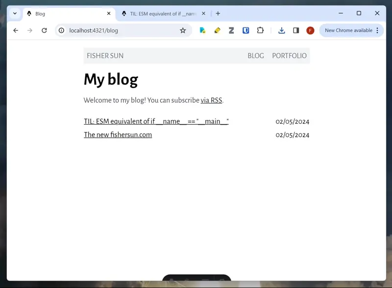
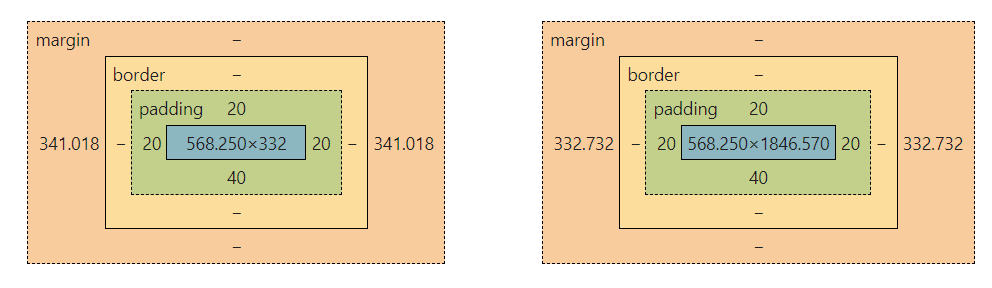

Yesterday, I guess I was feeling a little vain, so I was clicking around my own website, admiring my own work.

Until I realized, my content was shifting between pages.



Now that I know what the problem is, it seems quite obvious.
And if you, dear reader, have developed on Windows or Linux, you're probably shaking your head.
But I had only done web dev on my Mac, so I was seriously confused.

My first thought was that the content width of `<body>` differed between my pages.

Firing up devtools, I checked the box model for `<body>`.
It turned out, it was not the content that had different widths, but the *margins*.



My blog page's margins were 341.018 px wide, while my post's margins were 332.732 px wide.

I checked the other pages, and they all had margins widths of 332.732 px.
The only one that was different was the blog page.

What was different about my blog page? I looked at its source code, and saw nothing suspicious.
Nonetheless, I started changing things, hoping that it was because of a mistake in my CSS somewhere.

After about 40 minutes of that and no leads, I had to give up. I left the library and walked in shame back to my apartment.

After dinner, I showed my friend Andy this issue that was troubling me.

"Oh," he said, "that's because of the scrollbar".

---

Of course. I had only developed on my Mac, and since on Mac the scrollbar is drawn on top of the page, I had never had this problem.

But on Windows, the scrollbar is separate, so it pushes the content to the left.

Looking up solutions for this, I found a [CSS snippet from StackOverflow](https://stackoverflow.com/a/7607206) that makes it so that a scrollbar is always displayed.

```css
html {
    overflow-y: scroll;
}
```

Reading up more about this, I also found [this question on UX StackExchange](https://ux.stackexchange.com/questions/145259/should-scrollbars-be-integrated-into-the-viewport-width-when-content-differs) that discusses the problem.

The answer brings up a fairly new CSS property, [scrollbar-gutter](https://developer.mozilla.org/en-US/docs/Web/CSS/scrollbar-gutter).

I tried it, and it does fix the shift. But without drawing the scrollbar, it results in the margins looking uneven.
So, I went with the older solution.
