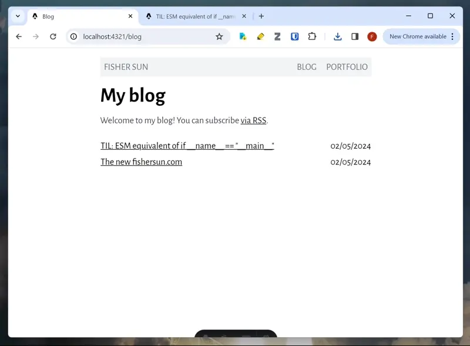
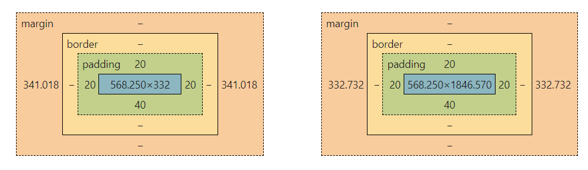

Yesterday, I guess I was feeling a little vain, because I was clicking around my own website, admiring my own work.

And it was nice, until I realized, my content was shifting between pages.



Now that I know what the problem is, it seems so obvious.
And if you, dear reader, have developed on Windows or Linux, you're probably shaking your head.
But I had only done web dev on my Mac, so I was seriously confused.

My first thought was that the content width of `<body>` differed between my pages.

Firing up devtools, I checked the box model for `<body>`.
It turned out, it was not the content that had different widths, but the *margins*.



My blog page's margins were 341.018 px wide, while my post's margins were 332.732 px wide.

I checked the other pages, and they all had margin widths of 332.732 px.
The only one that was different was the blog page.

How was it possible that pages could have different margin widths for the same content width?
This made no sense to me.

And, what was wrong about my blog page? I looked at its source code, and saw nothing suspicious.
Nonetheless, I started changing things, hoping that it was because of a CSS mistake somewhere.

After about 40 minutes of that and no leads, I had to give up.
I left the library and walked back to my apartment in shame.

After dinner, I showed [my friend Andy](https://github.com/ajy25) this issue.

"Oh," he said, "that's because of the scrollbar".

---

Of course! I had only developed on my Mac, and since on Mac the scrollbar is drawn on top of the page, I had never had this problem.

But on Windows, the scrollbar is separate, so it pushes the content to the left.

Looking up solutions for this, I found a [CSS snippet from StackOverflow](https://stackoverflow.com/a/7607206) that makes it so that a scrollbar is always displayed.

```css
html {
    overflow-y: scroll;
}
```

No more shift between pages!

## Addendum: scrollbar-gutter
Reading up more about this, I also found [this question on UX StackExchange](https://ux.stackexchange.com/questions/145259/should-scrollbars-be-integrated-into-the-viewport-width-when-content-differs) that discussed the problem.

The answer brought up a fairly new CSS property, [scrollbar-gutter](https://developer.mozilla.org/en-US/docs/Web/CSS/scrollbar-gutter).

I tried it, and it did fix the shift. But without drawing the scrollbar, it resulted in the margins looking uneven.
So, I went with the older solution.
