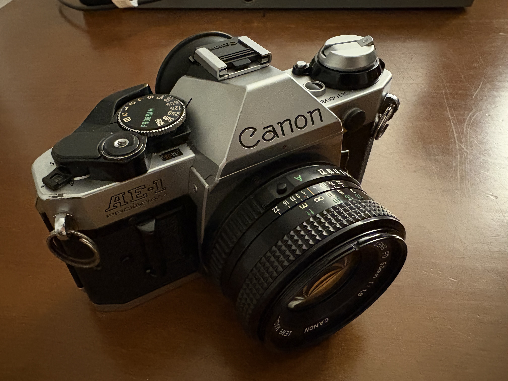

On Sunday, I bought a film camera at the flea market.
From some cursory research, it wasn't the best price for the particular model,
and when I asked the seller what his return policy was, the answer was basically “trust me, you won't need to return it.”

As I debated in my head if I should do more research and consider other options, a thought came to me.
A better option might exist, but who knows how long it'd take for me to start shooting if I looked for it?
On the other hand, since I was at the market with a camera right in front of me, I had the chance to start exploring photography that very day.

And so I bought it, and indeed I spent the rest of the day taking pictures with it.

That day, I used up all 36 exposures of my first roll of film (going to the beach helped), and the next day I took the film to the lab.

Waiting for the scans to come back was like waiting for Christmas morning as a kid.
Making the trip to the lab,
the anticipation of getting the scans back,
and the joy of finally seeing the pictures I took
made film photography feel so much more rewarding than any kind of photography I’d done before.
I had felt uncertain about going with a film camera,
thinking that not being able to see my work immediately would be a disadvantage.
But the slowness of film ended up being something I found beautiful.

As I write this, I realize it had been a while since I did something that had a delay in payoff like this.
These days, I tend to keep busy by going out to bars and trying new restaurants. (And I waste a lot of time scrolling.)
I'm realizing now that it had been a while since I had invested significant time and energy into my hobbies.

I used to be consistent with going to the gym, but not anymore;
I never seem to feel motivated to open any of the books sitting on my shelf;
I haven't baked something in ages.
And so I haven't felt that feeling of satisfaction that comes with putting time into something for a while.

So, getting into photography is a joyful return to that which takes time. And it makes me happy in other ways too.

Somehow, having a camera in my hands makes me a more social person.
Now, I was by no means an introverted person before this.
But holding a camera gives me a reason to be in a space and an excuse to talk to people.
At the beach, I saw a young man fishing.
Taking pictures of the ocean gave me an excuse to stand next to him as he fished, and we struck up a conversation.
It's sort of like how holding a drink in your hand at a party makes it easier to approach people.

And photography got me to get my steps in.
Today, taking photos in Brooklyn and Central Park, I totaled 28,104 steps, much higher than my average (which I will not disclose).
And I discovered the Conservatory Garden, which was absolutely beautiful.

I bought a bunch of film today, so I hope to continue to get out there, find lovely places, talk to people, and take cool pictures.
Stay tuned for more photography blog posts in the future!

## Acknowledgements
Many thanks to Joe, Sarah, and Charlene for reviewing the first version of this post!
