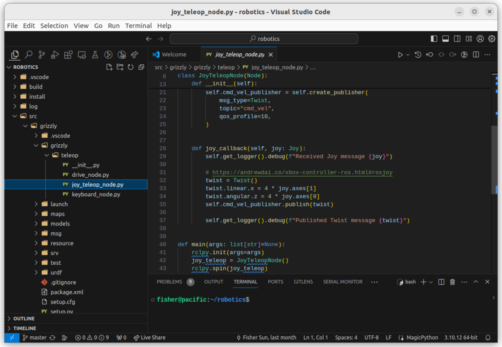
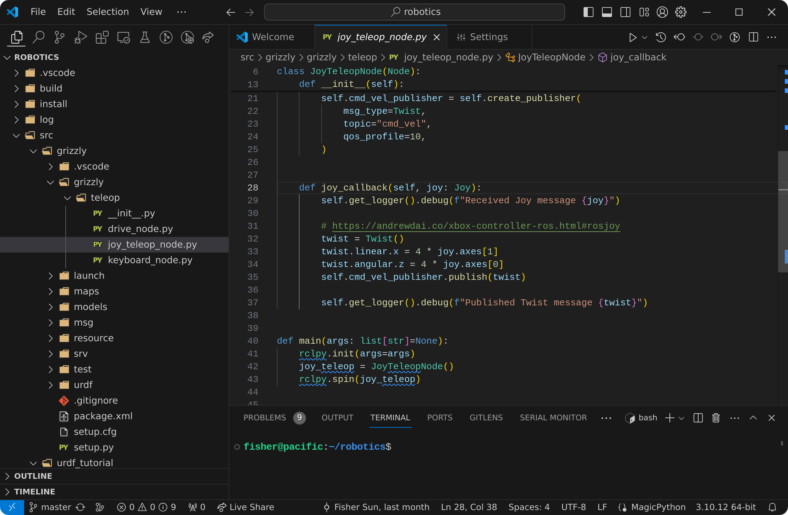

If you install VSCode on Ubuntu 22 LTS, it'll look like this:



Unfortunately, things don't Just Work (tm); VSCode has a few quirks with GNOME and Wayland.

## Making the title bar compact
VSCode normally has an integrated title bar that includes the the window decorations, menubar, and search bar.
But, on, GNOME, these elements are all placed in separate components by default, so you lose a lot of vertical screen real estate.

To fix this, go to your VSCode settings and search for `titleBarStyle`. Change its value from `native` to `custom`.

## Adding rounded corners back
Now, the title bar is compact, but it has sharp edges that look out of place in GNOME.

This is a known issue (VSCode [#153233](https://github.com/microsoft/vscode/issues/153233), electron [#33036](https://github.com/electron/electron/issues/33036)),
and the recommended workaround is to get the [Rounded Window Corners](https://extensions.gnome.org/extension/5237/rounded-window-corners/) GNOME extension.

## Fixing blurry text
With rounded corners, it almost looks perfect.
However, the text is blurry.

This is because it's using X11 instead of Wayland.
To check, run `xlsclients` while VSCode is running:
```console
fisher@pacific:~$ xlsclients
pacific  gsd-xsettings
pacific  ibus-x11
pacific  gnome-shell
pacific  code
```
If you see `code` in the output, VSCode is using X11.
To make it use Wayland, make a copy of the `.desktop` file (this allows the configuration to [persist across updates](https://askubuntu.com/questions/861303/stop-apt-upgrade-from-replacing-desktop-file)):
```
cp /usr/share/applications/code.desktop ~/.local/share/applications/
```
Edit `~/.local/share/applications/code.desktop` and modify Exec to include the flags `--enable-features=UseOzonePlatform` and  `--ozone-platform=wayland`. Mine looks like:
```
Exec=/usr/share/code/code --unity-launch --enable-features=UseOzonePlatform --ozone-platform=wayland %F
```

Relaunch VSCode, and you'll have crisp looking text.

## Finished result
Here is the finished result after applying the above configuration.


Ah, that's much better.

## Addendum: make it stop prompting for your password
If your VSCode prompts for your password every time you launch it after restarting,
[you can fix that by adding another flag](https://askubuntu.com/a/968149) to the Exec field of the `.desktop` file.

Edit `~/.local/share/applications/code.desktop` again and modify Exec to include `--password-store=basic`. Mine now looks like:
```
Exec=/usr/share/code/code --unity-launch --enable-features=UseOzonePlatform --ozone-platform=wayland --password-store=basic %F
```

