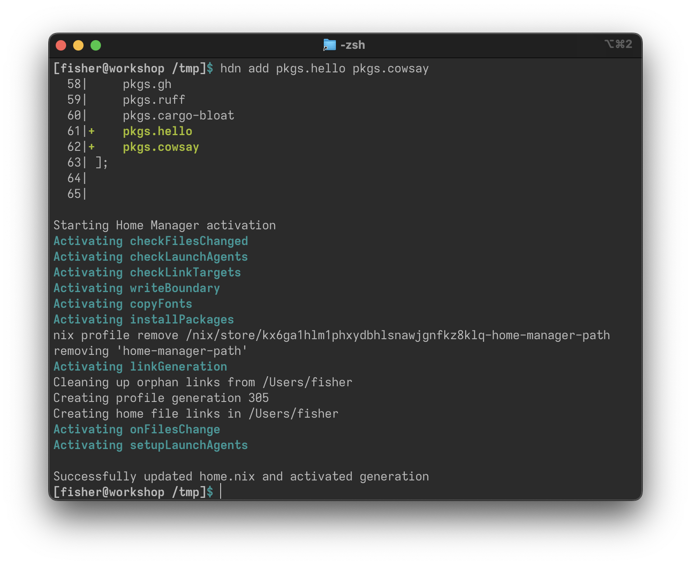

I was using Home Manager to install my packages, but I found its workflow of manually editing the `home.nix` file (and manually reverting it if something went wrong) tedious. So, I used Rust to create `hdn`: a tool that takes care of `home.nix` just like how Cargo takes care of `Cargo.toml`.

I've found HDN very useful for my own use case. I've replaced nearly all of my invocations of `home-manager` with invocations of `hdn`.