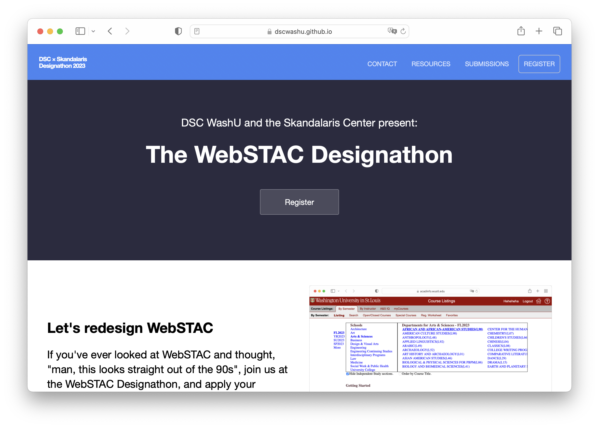

In my junior year, my club, DSC WashU, hosted a designathon for students to redesign WebSTAC. I developed the website for the event.
It shows the event information, lists resources for participants, and dynamically displays submissions.

This was a static website built with Jekyll that used Airtable to store submissions and vanilla JS to query them. This tech stack allowed me to avoid setting up infrastructure for hosting: I could just deploy with GitHub Pages.
